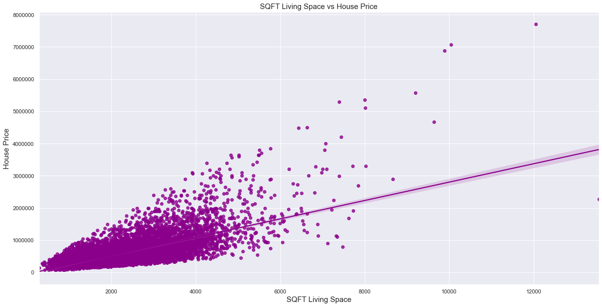
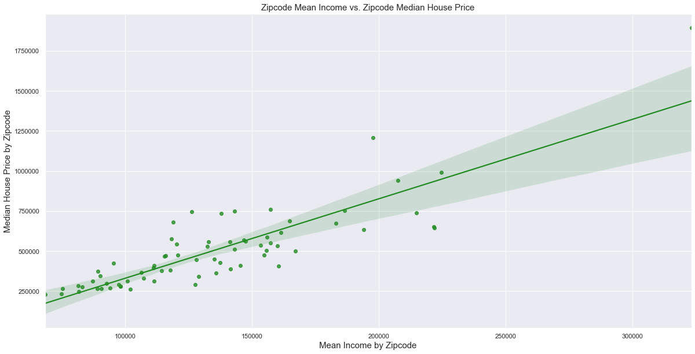
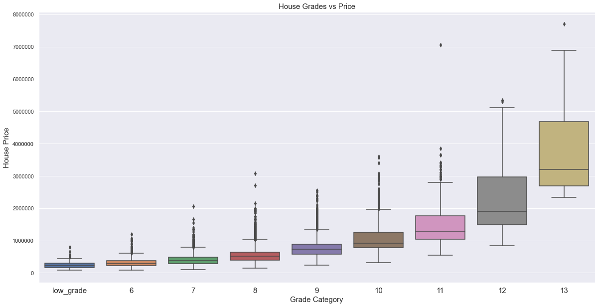
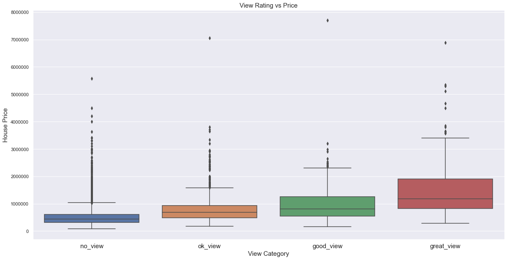
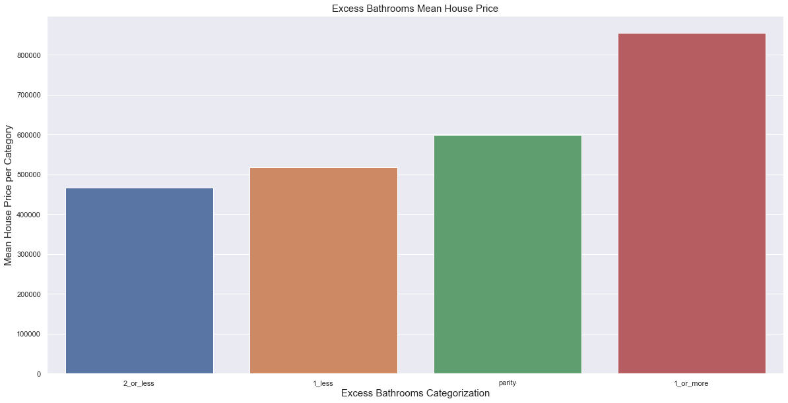
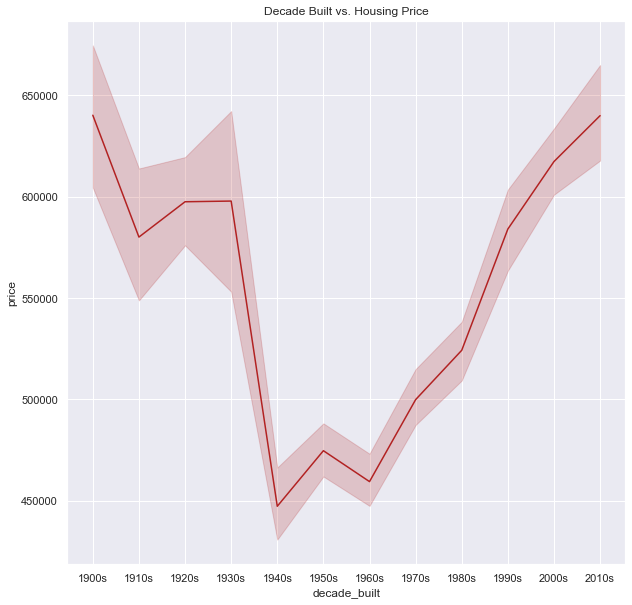

# Kings County Housing Bake-off
### Author: Gary Schwaeber


## Overview
The goal of this project is to explore housing data from Kings County, WA and to use the data to build a model to predict housing prices.

The Kings_County_Housing_Bake-off.ipynb file contains the exploratory data analysis on the Kings County housing data, feature engineering, model building, and the final model.

The Predict_Holdout.ipynb file contains the application of the same cleaning techniques and feature engineering on the holdout dataset and ultimately predictions applied by the final model.

The data folder contains the training data set, holdout data set, prediction data set, census data for getting zip code information, a pickle file containing the final model, and a pickle file containing other information used to clean the holdout data and apply the model.


## Repository Structure

```
├── data
├── images
├── .gitignore
├── Kings_County_Housing_Bake-off.ipynb
├── Predict_Holdout.ipynb
└── README.me
```
## Exploratory Data Analysis
Initial columns provided in the data set include:

id - unique ID for a house
date - Date day house was sold
price - Price is prediction target
bedrooms - Number of bedrooms
bathrooms - Number of bathrooms
sqft_living - square footage of the home
sqft_lot - square footage of the lot
floors - Total floors (levels) in house
waterfront - Whether house has a view to a waterfront
view - Number of times house has been viewed
condition - How good the condition is (overall)
grade - overall grade given to the housing unit, based on King County grading system
sqft_above - square footage of house (apart from basement)
sqft_basement - square footage of the basement
yr_built - Year when house was built
yr_renovated - Year when house was renovated
zipcode - zip code in which house is located
lat - Latitude coordinate
long - Longitude coordinate
sqft_living15 - The square footage of interior housing living space for the nearest 15 neighbors
sqft_lot15 - The square footage of the land lots of the nearest 15 neighbors


Some of the key feature discovered from the EDA that required further investigation include sqft living space, zip code mean income, grade, view, excess bathrooms, and decade built. The below heatmap shows the correlation with some potentially significant numerical features and price. 


Of note sqft_living had the highest correlation with price, a regplot shows a clear positive relationship


Mean income by zip code and median house by zip code also showed a strong positive relationship


Grade is an important factor in house price, even exponential as differences of house price distributions are greater in higher grade steps than lower grade steps.


Views was also a big factor in the price of houses.


I have a theory that having more bathrooms than bedrooms in a house makes it more valuable. People want their own bathrooms and don't want their guests to be in their or their child's personal bathroom. Having a batter ratio of bathrooms to bedrooms in the house could make it more valuable. I created a feature excess bathrooms which is bathrooms - bedrooms (rounded up because a half bathroom is still a bathroom!). I then categorized to bin some the outlier houses where the deficit or surplus was huge. In my EDA, as shown by the below bar chart, it seems like this feature does positively impact price and ultimately this feature was utilized in my final model. 


An interesting data quirk that I found, houses built before the 40's sell for higher prices today than houses built in subsequent decades This is somewhat surprising. There must be some legacy architectural or building material appeal to these old houses or maybe there is some survivorship bias that if they haven’t been leveled and turned into new construction yet, they are appealing houses worthy of being saved. Outside of this Pre-War period, it appear newer construction is king.


## Feature Engineering 

In addition to excess bathrooms I created various other feature in hopes these would have some significance including month sold, season sold, years since most recent construction, yard, and zip code family to nonfamily ratio. I also created some interaction features for some of the more significant numerical variables with each other that had the potential to be included in the final model. 

## Prediction Modeling
Going into the modeling process, there were 58 features to select from for the final model. I primarily used RMSE to determine which model would perform best. 

I started with a basic model handpicked using 24 features I thought would be most releveant based on the EDA and attempting to avoid features that would cause multicollinearity issues. After fitting it on price and the natural log of price, the model fit on price performed best with a test RMSE 176947, though the model fit on log price had a lower variance and test RMSE of 183771

I then used Scikit Learn's SelectKBest feature selection algorithm and looped through different number of Ks and fitted on price and log price. Ultimately, the best model had K = 48 and was fitted on log price and result in a train RMSE of 139636 and test RMSE of 128780 

Finally I tried Scikit Learn's Recursive Feature Elimination algorithm and fitting to price and log price. Fitting to log price gave the lowest train RMSE of 139304 and test RMSE of 128703. This algorithm ended up not actually eliminating any features, so I was concerned this model may overfit on the data more than the Select K Best model

## Conclusion

Ultimately, I chose the Select K Best model with K = 48 fit on log price to submit as my final model. After refitting it to the entire training dataset the RMSE was 136761. 

This model along with some of the data cleaning techniques and features I engineered were then applied to a holdout dataset. 


